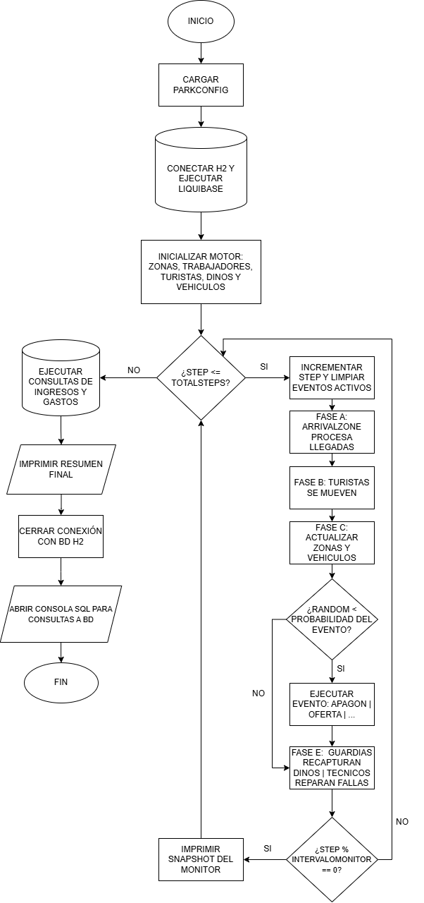

# Laboratorio 4. Parque Turistico de Dinosaurios.

Proyecto desarrollado para la evaluación del bloque 4 del curso Java-Python, el cual implementa una simulación secuencial de un parque temático de dinosaurios con arquitectura orientada a objetos y persistencia en la base de datos.

# Explicación General.

El sistema simula la gestión operativa de un parque, controlando el flujo no determinista de visitantes, el estado de los dinosaurios, el mantenimiento de instalaciones (Energia y vehiculos), así como la ocurrencia de eventos aleatorios (apagones, escapes, etc.).

# Herramientas implementadas.

1. Lenguaje: Java 17
2. Gestor de dependencias: Maven
3. Base de datos: H2 Database
4. Migraciones: Liquibase
5. Testing: JUnit 5 y Mockito
6. Cobertura: JaCoCo

# Instrucciones de configuración.

1. Instalar JDK 17 o superior y Maven
2. Clonar este repo en tu maquina local
3. El proyecto descargará automaticamente las dependencias necesarias de H2, Liquibase y JUnit al compilar.
4. Dentro del archivo "park.properties" que se encuentra en la dirección "src/main/resources/" se presentan los parametros configurables para la ejecución del proyecto.

# Forma de ejecución.

1. En la terminal se escribe el comando "mvn compile" el cual realizará la compilación del proyecto para verificar que no existan errores.
2. En la terminal se escribe el comando "mvn exec:java" para ejecutar el proyecto.
3. (Opcional) Al terminar la ejecución del proyecto se abrirá la linea de comandos sql de H2 donde se podrán ejecutar distintos querys sobre la bd generada por el proyecto. En caso de necesitar salir, se deberá escribir la palabra "exit", la cual terminará la ejecución del proyecto.

# Ejecutar pruebas unitarias.
1. Para validar las pruebas unitarias, se escribe el comando "mvn test" en la terminal del proyecto, la cual ejecutará las pruebas.
2. (Opcional) En la dirección "target/site/" se puede abrir el archivo "index.html" el cual muestra el resultado de las pruebas de manera mas gráfica.

# Diagrama de flujo

